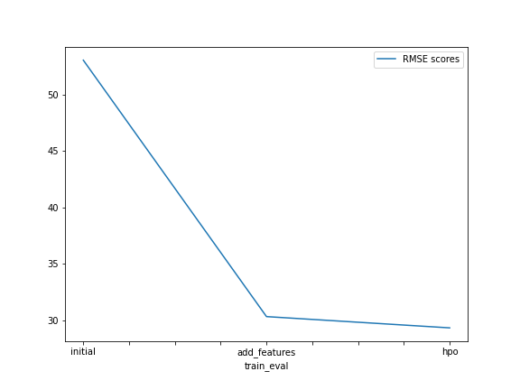
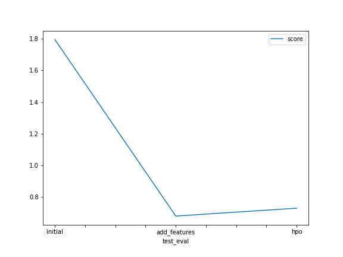

# Report: Predict Bike Sharing Demand with AutoGluon Solution
#### VIANNEY KIMURI

## Initial Training
### What did you realize when you tried to submit your predictions? What changes were needed to the output of the predictor to submit your results?
DONE: Add your explanation
- The initial submission did not have an negative values in its prediction. 
- I also noticed that the evaluation metric we used for all the models in the project as well, had negative values. The metric we used
  was root mean square error(RMSE)

### What was the top ranked model that performed?
DONE: Add your explanation
- The top ranked model that performed is `WeightedEnsemble_L3` model.

## Exploratory data analysis and feature creation
### What did the exploratory analysis find and how did you add additional features?
DONE: Add your explanation
- Exploratory analysis helped in identifying features/columns that were being read as `int` and we converted them to `category` types.
  We also used the Datetime column to create new features for example the `Hour` column.
- We also parsed the `datetime` feature to a datatime datatype for easier interpretation and processing.

### How much better did your model preform after adding additional features and why do you think that is?
DONE: Add your explanation
- I think my model performed worse than the model from initial training, hence the introduction of new features did not improve 
  its performance.

## Hyper parameter tuning
### How much better did your model preform after trying different hyper parameters?
DONE: Add your explanation
- After trying different hyperparameters, the model made an improvement from when we added features to the data it was trained on. 
  There was defintely a significant improvement in the score even with the new features included 
  
### If you were given more time with this dataset, where do you think you would spend more time?
DONE: Add your explanation
- I would spend more time tuning the hyperparameters until I can find a set which can provide a highly performant model.
  I believe the hyperparameters have a great impact on the model's performance.
  
### Create a table with the models you ran, the hyperparameters modified, and the kaggle score.
|model|time_limit|presets|num_bag_folds|score|
|--|--|--|--|--|
|initial|600|best_quality|None|1.79458|
|add_features|600|best_quality|None|0.68010|
|hpo|1200|high_quality|5.0|0.72977|

### Create a line plot showing the top model score for the three (or more) training runs during the project.

DONE: Replace the image below with your own.

### Create a line plot showing the top kaggle score for the three (or more) prediction submissions during the project.

DONE: Replace the image below with your own.

## Summary
TODO: Add your explanation
- The model hyperparameters always play a large role in the overall performance of the model. 
- If a dataset includes very many features, then it may need a larger training time to achieve a reasonable accuracy.